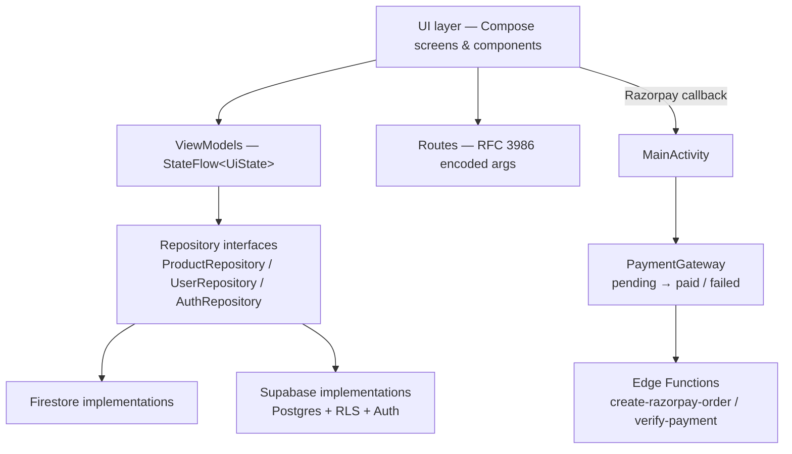

# WooCom

[](https://github.com/riCl3/WooCom/actions/workflows/ci.yml)

A Jetpack Compose e-commerce app (browse → search → cart → Razorpay checkout → order history) built as an
exercise in clean Android architecture: screens never talk to a backend SDK directly, state lives in
`StateFlow`s, and every network call has an explicit loading / error / retry path. Two backends run behind
the same interfaces — Firestore by default, Supabase (Postgres + RLS + Auth + Edge Functions) when
`SUPABASE_URL` is configured — so the whole switch is one `ServiceLocator`.

---

## Features

| Area | What works |
| --- | --- |
| Catalogue | Home feed with banner carousel, category rail, product rows, pull-to-refresh |
| Search | Route-encoded query (`Routes.search("50% off")` no longer crashes) with empty/error states |
| Product | Details screen with gallery, discount %, specs, optimistic favourite toggle with rollback |
| Cart | Atomic quantity writes (`FieldValue.increment`), batched product lookups (no N+1), live totals |
| Checkout | Order persisted as `pending` **before** Razorpay opens, settled from the payment callback |
| Orders | Real order list with status badges (`paid` / `pending` / `failed`) instead of a static empty state |
| Account | Email auth, profile, favourites, sign-out, guest → sign-in state on the profile tab |
| UX | Loading / error-with-retry / empty states on every data screen, `key`s in every lazy list |

## Architecture

MVVM with a repository seam. The rule the codebase enforces: **`com.example.woocom.data.*` is the only package
that may import a backend SDK** (Firebase *or* Supabase). Every screen depends on an interface, which is why
the Firestore → Supabase swap touched no screen beyond the two entry points that were backend-aware.



**Layers**

- `screens/`, `pages/`, `components/` — pure Compose. No backend imports, no business logic; they collect a
  `StateFlow` and call suspend functions on a ViewModel.
- `viewmodel/` — `AuthViewModel` (`sealed interface AuthUiState`), `HomeViewModel` (one fetch → all home tabs,
  so switching tabs no longer refetches), `CartViewModel` (`CartState` + one-shot message stream).
- `data/` — `Resource<T>` (`Loading`/`Success`/`Error`), `ProductRepository`, `UserRepository`,
  `AuthRepository`, `PaymentGateway`, `ServiceLocator` (manual DI — deliberate: a DI framework would add setup
  cost without buying anything at this size), and both backends' implementations.
- `model/` — data classes kept in one place, `@Serializable` with `@SerialName` + two custom serializers
  (`IsoDateTimeAsEpochMillis`, `AnyMapAsJsonObject`) for the Postgres/Firestore shape difference.

**Notable decisions**

- *`Resource<T>` instead of nullable data + a `loading` boolean*: a network failure is no longer rendered as
  "nothing here", which is the single most common bug in this kind of app.
- *Order written before payment*: `CheckoutPage` asks `PaymentGateway.beginCheckout()` for a `pending` order,
  `PaymentSession` carries it to the Activity that owns the Razorpay callback, and `PaymentGateway` settles
  it to `paid`/`failed`. A crash mid-payment leaves a recoverable row instead of a paid-looking order with no
  payment.
- *The amount never comes from the client* on Supabase: `create-razorpay-order` totals `cart_items` itself,
  and `verify-payment` recomputes the HMAC before `mark_order_paid` runs with the service-role key.
- *`PaymentResultWithDataListener`, not `PaymentResultListener`*: the Razorpay SDK checks the plain listener
  first and short-circuits to it, which would drop the `payment_id`/`signature` the verifier needs.
- *Backend switch is `BuildConfig`-driven*: unset `SUPABASE_URL` ⇒ Firestore, set ⇒ Supabase — no build
  flavour, reversible with a property.
- *Client-side price maths is still visible and centralised* (`AppUtil.lineTotal`) — and documented as the
  thing the server-side Razorpay order replaces on Supabase.
- *No navigation-arg `totalAmount` anymore*: checkout recomputes its own total from the cart, so a tampered
  deep link can't set the amount.

## Tech stack

Kotlin 2.4 · Jetpack Compose (BOM) · Material 3 + a Material 2 `pullrefresh` · Navigation-Compose ·
Lifecycle `StateFlow` / `collectAsStateWithLifecycle` · Firebase Auth + Firestore **or** Supabase
(Postgres + RLS + Auth + Edge Functions) · kotlinx.serialization · Ktor · Coil · Razorpay · JUnit 4 ·
GitHub Actions.

## Project structure

```
app/src/main/java/com/example/woocom/
├── AppNavigation.kt      # NavHost, argument decoding
├── Routes.kt             # route registry + RFC 3986 percent-encoding
├── data/                 # repositories, Resource, PaymentGateway, ServiceLocator ← backends live here
├── viewmodel/            # Auth / Home / Cart ViewModels
├── model/                # ProductModel, CategoryModel, UserModel, OrderModel + serializers
├── screens/              # splash, auth, login, signup, home shell
├── pages/                # home, search, product, cart, checkout, orders, profile
└── components/           # shared Compose UI + loading/error/empty states

supabase/
├── migrations/           # schema, RLS, mark_order_paid / mark_order_failed / add_to_cart
├── functions/            # create-razorpay-order, verify-payment (Deno)
└── seed.sql              # local catalogue + categories
```

## Data model

Firestore (the default backend) and Postgres (Supabase) hold the same facts; the mapping is tabled in
[MIGRATION.md](MIGRATION.md).

| Firestore | Supabase |
| --- | --- |
| `data/stock/products` | `public.products` (`actual_price`, `other_details: jsonb`) |
| `data/stock/categoties` | `public.categories` (typo corrected in SQL) |
| `data/banner` (`urls`) | `public.banners.urls` |
| `user/{uid}` doc | `public.profiles` + `public.cart_items` + `public.favorites` (row per entry) |
| `orders` | `public.orders` (`items` stays jsonb, `status` `pending/paid/failed`) |

## Measured results

Numbers from this repo (before = `b793fdd`, after = current `master`):

| Metric | Before | After |
| --- | --- | --- |
| Files that call `Firestore.collection()` | 15 | 2 (both inside `data/`) |
| Firestore reads per home refresh | 7 (4 carousel queries + categories + banners + profile) | 3 (one product query feeds all four carousels) |
| Refetch on bottom-tab switch | full re-query of the home screen | 0 (`HomeViewModel` is scoped to the back-stack entry) |
| Cart rows | one product query per row (N+1) | one batched `whereIn` (chunked at Firestore's 30-item limit) |
| Unit tests | 1 file, 5 assertions | 25 assertions (price/format, routes, serializers) |
| APK | 25.9 MB (debug) | **5.1 MB** release (R8 + resource shrinking) |

## Setup

```bash
git clone https://github.com/riCl3/WooCom.git && cd WooCom
./gradlew :app:assembleDebug
```

Requirements: JDK 17, Android SDK 36, `app/google-services.json` (already present for the demo project).

Optional payment key (never committed — interpolated as a `BuildConfig` field):

```properties
# gradle.properties or ~/.gradle/gradle.properties
RAZORPAY_KEY_ID=rzp_test_xxxxxxxx
```

Optional Supabase backend (leave both unset to keep running against Firestore):

```properties
SUPABASE_URL=http://127.0.0.1:54321
SUPABASE_ANON_KEY=eyJ...
```

```bash
supabase start                 # Docker; applies supabase/migrations/*.sql then seed.sql
supabase functions serve       # loads .env with RAZORPAY_KEY_ID / RAZORPAY_KEY_SECRET
```

Release signing is opt-in via `WOOCOM_KEYSTORE`, `WOOCOM_KEYSTORE_PASSWORD`, `WOOCOM_KEY_ALIAS`,
`WOOCOM_KEY_PASSWORD`; without them `assembleRelease` still produces an unsigned APK, which keeps CI green.

## Testing & CI

```bash
./gradlew :app:lintDebug            # Android Lint, abortOnError = true
./gradlew :app:ktlintCheck          # code style (.editorconfig), auto-fix with ktlintFormat
./gradlew :app:testDebugUnitTest    # price parsing/formatting, route encoding, Postgres row serializers
./gradlew :app:assembleRelease      # R8 minify + resource shrinking
```

`.github/workflows/ci.yml` runs lint → ktlint → unit tests → debug assemble on every push and PR, uploads
reports on failure, and writes a job summary. Instrumented tests exist but are not run in CI (no emulator on
the runner).

## Security notes & roadmap

Honest state of the art for this repo:

- **Supabase backend (Phase 3, implemented):** Postgres with `auth.uid()`-scoped RLS for
  cart/favourites/orders, `mark_order_paid` callable only by the service-role key, `mark_order_failed` a
  `security definer` RPC that refuses anything but the caller's own `pending` row, and Deno Edge Functions
  that create the Razorpay order from `cart_items` server-side and verify the payment HMAC signature. See
  [MIGRATION.md](MIGRATION.md).
- **Firestore backend (the default):** amounts and cart contents are computed client-side, so a modified APK
  could underpay — that is the standing limitation of the legacy path, and the reason the Supabase switch
  exists.
- Firestore rules are assumed to be uid-scoped; the app resolves the user document by `user/{uid}` everywhere
  (no `whereEqualTo` lookups).
- Not yet exercised against a live Supabase project: the schema, RPCs and functions are verified by compile +
  review only in this repo (no credentials or emulator in CI).

Roadmap: live Supabase smoke test, export the Firestore catalogue into `seed.sql`, offline Room cache,
`paging3` catalogue, Compose UI tests, Baseline Profile, dark-mode and accessibility passes.
