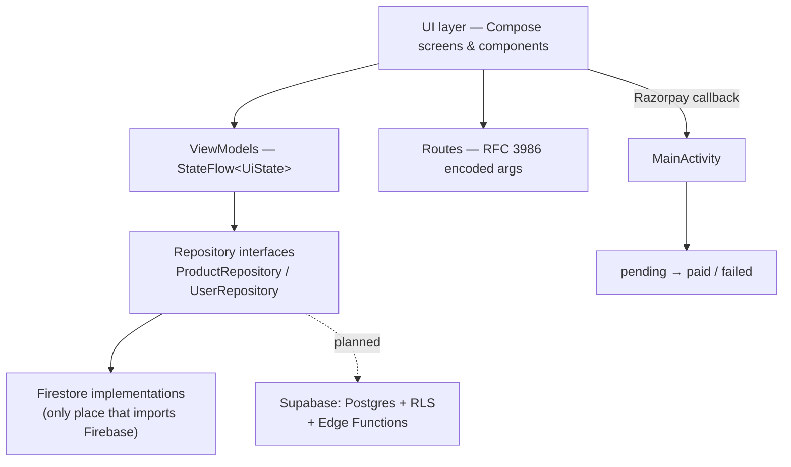

# WooCom

[](https://github.com/riCl3/WooCom/actions/workflows/ci.yml)

A Jetpack Compose e-commerce app (browse → search → cart → Razorpay checkout → order history) built as an
exercise in clean Android architecture: screens never talk to Firebase directly, state lives in `StateFlow`s,
and every network call has an explicit loading / error / retry path.

---

## Features

| Area | What works |
| --- | --- |
| Catalogue | Home feed with banner carousel, category rail, product rows, pull-to-refresh |
| Search | Route-encoded query (`Routes.search("50% off")` no longer crashes) with empty/error states |
| Product | Details screen with gallery, discount %, specs, optimistic favourite toggle with rollback |
| Cart | Atomic quantity writes (`FieldValue.increment`), batched product lookups (no N+1), live totals |
| Checkout | Order persisted as `pending` **before** Razorpay opens, settled from the payment callback |
| Orders | Real order list with status badges (`paid` / `pending` / `failed`) instead of a static empty state |
| Account | Email auth, profile, favourites, sign-out, guest → sign-in state on the profile tab |
| UX | Loading / error-with-retry / empty states on every data screen, `key`s in every lazy list |

## Architecture

MVVM with a repository seam. The rule the codebase enforces: **`com.example.woocom.data.*` is the only package
that may import Firebase.** Every screen depends on an interface, which is what makes the planned
Firestore → Supabase migration a contained diff instead of a rewrite.



**Layers**

- `screens/`, `pages/`, `components/` — pure Compose. No Firebase imports, no business logic; they collect a
  `StateFlow` and call suspend functions on a ViewModel.
- `viewmodel/` — `AuthViewModel` (`sealed interface AuthUiState`), `HomeViewModel` (one fetch → all home tabs,
  so switching tabs no longer refetches), `CartViewModel` (`CartState` + one-shot message stream).
- `data/` — `Resource<T>` (`Loading`/`Success`/`Error`), `ProductRepository`, `UserRepository`,
  `ServiceLocator` (manual DI — deliberate: a DI framework would add setup cost without buying anything at
  this size).
- `model/` — Firestore POJOs kept in one place (R8 keeps them intact).

**Notable decisions**

- *`Resource<T>` instead of nullable data + a `loading` boolean*: a network failure is no longer rendered as
  "nothing here", which is the single most common bug in this kind of app.
- *Order written before payment*: `CheckoutPage` creates a `pending` order, `PaymentSession` carries its id to
  the Activity that owns the Razorpay callback, which flips it to `paid`/`failed`. A crash mid-payment leaves a
  recoverable row instead of a paid-looking order with no payment.
- *Client-side price maths is still visible and centralised* (`AppUtil.lineTotal`) — and documented as the
  thing the server-side Razorpay order replaces.
- *No navigation-arg `totalAmount` anymore*: checkout recomputes its own total from the cart, so a tampered
  deep link can't set the amount.

## Tech stack

Kotlin 2.0 · Jetpack Compose (BOM) · Material 3 + a Material 2 `pullrefresh` · Navigation-Compose ·
Lifecycle `StateFlow` / `collectAsStateWithLifecycle` · Firebase Auth + Firestore · Coil · Razorpay ·
JUnit 4 · GitHub Actions.

## Project structure

```
app/src/main/java/com/example/woocom/
├── AppNavigation.kt      # NavHost, argument decoding
├── Routes.kt             # route registry + RFC 3986 percent-encoding
├── data/                 # repositories, Resource, ServiceLocator   ← Firebase lives here
├── viewmodel/            # Auth / Home / Cart ViewModels
├── model/                # ProductModel, CategoryModel, UserModel, OrderModel
├── screens/              # splash, auth, login, signup, home shell
├── pages/                # home, search, product, cart, checkout, orders, profile
└── components/           # shared Compose UI + loading/error/empty states
```

## Data model (today: Firestore)

| Collection | Purpose |
| --- | --- |
| `data/stock/products` | catalogue (`id`, `title`, `price`, `actualPrice`, `category`, `images`) |
| `data/stock/categoties` | categories — spelled this way in the live backend; corrected in the planned SQL schema |
| `data/banner` | `urls: [...]` |
| `user/{uid}` | profile, `cartItems: {productId: qty}`, `favorites: {productId: true}` |
| `orders` | `userId`, `amount`, `items`, `status`, `paymentId`, `createdAt` |

## Measured results

Numbers from this repo (before = `b793fdd`, after = current `master`):

| Metric | Before | After |
| --- | --- | --- |
| Files that call `Firestore.collection()` | 15 | 2 (both inside `data/`) |
| Firestore reads per home refresh | 7 (4 carousel queries + categories + banners + profile) | 3 (one product query feeds all four carousels) |
| Refetch on bottom-tab switch | full re-query of the home screen | 0 (`HomeViewModel` is scoped to the back-stack entry) |
| Cart rows | one product query per row (N+1) | one batched `whereIn` (chunked at Firestore's 30-item limit) |
| Unit tests | 1 file, 5 assertions | 16 assertions incl. locale-explicit formatting + route encoding |
| APK | 25.9 MB (debug) | **5.1 MB** release (R8 + resource shrinking) |

## Setup

```bash
git clone https://github.com/riCl3/WooCom.git && cd WooCom
./gradlew :app:assembleDebug
```

Requirements: JDK 17, Android SDK 35, `app/google-services.json` (already present for the demo project).

Optional payment key (never committed — interpolated as a `BuildConfig` field):

```properties
# gradle.properties or ~/.gradle/gradle.properties
RAZORPAY_KEY_ID=rzp_test_xxxxxxxx
```

Release signing is opt-in via `WOOCOM_KEYSTORE`, `WOOCOM_KEYSTORE_PASSWORD`, `WOOCOM_KEY_ALIAS`,
`WOOCOM_KEY_PASSWORD`; without them `assembleRelease` still produces an unsigned APK, which keeps CI green.

## Testing & CI

```bash
./gradlew :app:lintDebug            # Android Lint, abortOnError = true
./gradlew :app:ktlintCheck          # code style (.editorconfig), auto-fix with ktlintFormat
./gradlew :app:testDebugUnitTest    # price parsing/formatting, route encoding, line totals
./gradlew :app:assembleRelease      # R8 minify + resource shrinking
```

`.github/workflows/ci.yml` runs lint → ktlint → unit tests → debug assemble on every push and PR, uploads
reports on failure, and writes a job summary. Instrumented tests exist but are not run in CI (no emulator on
the runner).

## Security notes & roadmap

Honest state of the art for this repo:

- Amounts and cart contents are still computed client-side; an attacker with a modified APK could underpay.
  **Next step (Phase 3):** Supabase — Postgres with `auth.uid()`-scoped RLS for cart/favourites/orders, plus a
  Deno Edge Function that creates the Razorpay order from `cart_items` server-side and verifies the payment
  HMAC signature. The repository interfaces are already the seam this slots into.
- Firestore rules are assumed to be uid-scoped; the app resolves the user document by `user/{uid}` everywhere
  (no `whereEqualTo` lookups).

Roadmap: server-side payments, Supabase migration + `MIGRATION.md`, offline Room cache, `paging3` catalogue,
Compose UI tests, Baseline Profile, dark-mode and accessibility passes.
